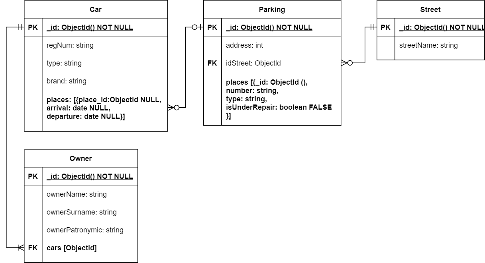

# Документная база данных
## Цель работы
Моделирование структуры документной базы данных (далее БД), работа с документами JSON.

## Задание
1. Спроектировать структуру json файла (физическую модель), соответствующую предметной области.

2. Создать базу MongoDB с тестовыми данными для запросов.

3. Привести пример обновления и удаления данных из документной базы данных.

4. Выполнить запросы на выборку из базы данных;
   - запрос на поиск подстроки;
   - запрос на использование одного документа несколько раз;
   - запрос с условием на агрегатную функцию;
   - запрос получением агрегатной функции от агрегатной функции;
   - запрос на разность 2 запросов.

---
## Выполнение работы
Мной была спроектирована физическая модель для следующей предметной области:

**Охраняемые парковки**: адрес парковки, машина, тип машины (грузовая, легковая, с прицепом и т.д.), и места под разные типы машин, под ремонт, владелец, место, рег. номер машины, дата и время заезда, дата и время выезда 

Запросы:
а. все парковки, расположенные на линиях (не улицах или проспектах)(улица в адресе содержит «линия») 
б. владелец машины, у которого есть машины разных типов 
в. владелец машин, заезжавший раньше всех 
г. владелец машины, останавливавшийся на ремонт на минимальном числе парковок  
д. владелец, не парковавшийся на Вознесенском проспекте

**Физическая модель:**

Заполнение базы данных представлено в файле [insert_data.js](insert_data.js).

Запросы реализованы в файле [queries.js](queries.js).

---
